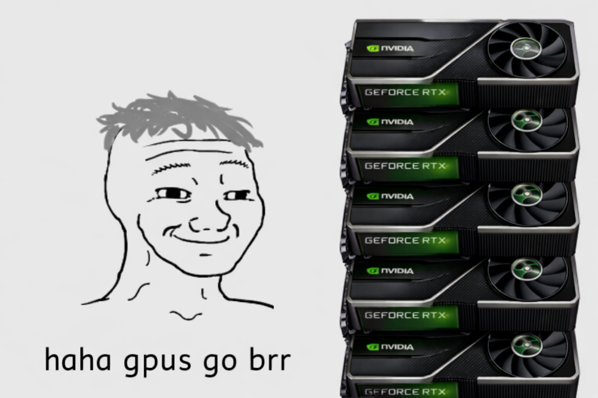

```{=html}
<style>
img {
  max-width: 100%;
  height: auto;
}
pre code {
  white-space: pre-wrap;
  word-wrap: break-word;
}
</style>
```

> This blog post got featured on [Towards Data Science](https://towardsdatascience.com/understanding-the-host-and-device-paradigm/)!

This article is part of a series about distributed AI across multiple GPUs:

- **Part 1: Understanding the Host and Device Paradigm** (this article)
- [Part 2: Point-to-Point and Collective Operations](../2025-09-23-torch-distributed-operations/)
- [Part 3: How GPUs Communicate](../2025-10-01-how-gpus-communicate/)
- [Part 4: Gradient Accumulation & Distributed Data Parallelism (DDP)](../2025-10-12-ddp/)
- [Part 5: ZeRO](../2025-10-25-ZeRO/)
- Part 6: Tensor Parallelism *(coming soon)*

# Introduction

This guide explains the foundational concepts of how a CPU and a discrete graphics card (GPU) work together. It's a high-level introduction designed to help you build a mental model of the host-device paradigm. We will focus specifically on NVIDIA GPUs, which are the most commonly used for AI workloads.

*For integrated GPUs, such as those found in Apple Silicon chips, the architecture is slightly different, and it won't be covered in this post.*

# The Big Picture: The Host and The Device

The most important concept to grasp is the relationship between the **Host** and the **Device**.

*   **The Host:** This is your **CPU**. It runs the operating system and executes your Python script line by line. The Host is the commander; it's in charge of the overall logic and tells the Device what to do.
*   **The Device:** This is your **GPU**. It's a powerful but specialized coprocessor designed for massively parallel computations. The Device is the accelerator; it doesn't do anything until the Host gives it a task.

Your program always starts on the CPU. When you want the GPU to perform a task, like multiplying two large matrices, the CPU sends the instructions and the data over to the GPU.

# The CPU-GPU Interaction

The Host talks to the Device through a queuing system.

1.  **CPU Initiates Commands:** Your script, running on the CPU, encounters a line of code intended for the GPU (e.g., `tensor.to('cuda')`).
2.  **Commands are Queued:** The CPU doesn't wait. It simply places this command onto a special to-do list for the GPU called a **CUDA Stream** — more on this in the next section.
3.  **Asynchronous Execution:** The CPU does not wait for the actual operation to be completed by the GPU, the host moves on to the next line of your script. This is called **asynchronous execution**, and it's a key to achieving high performance. While the GPU is busy crunching numbers, the CPU can work on other tasks, like preparing the next batch of data.

# CUDA Streams

A **CUDA Stream** is an ordered queue of GPU operations. Operations submitted to a single stream execute **in order**, one after another. However, operations across *different* streams can execute **concurrently** — the GPU can juggle multiple independent workloads at the same time.

By default, every PyTorch GPU operation is enqueued on the **current active stream** (it's usually the default stream which is automatically created). This is simple and predictable: every operation waits for the previous one to finish before starting. For most code, you never notice this. But it leaves performance on the table when you have work that *could* overlap.

## Multiple Streams: Concurrency

The classic use case for multiple streams is **overlapping computation with data transfers**. While the GPU processes batch N, you can simultaneously copy batch N+1 from CPU RAM to GPU VRAM:

```
Stream 0 (compute): [process batch 0]──────────[process batch 1]──────────
Stream 1 (data):       [copy batch 1]──────[copy batch 2]──────────────────
```

This pipeline is possible because compute and data transfer happen on separate hardware units inside the GPU, enabling true parallelism. In PyTorch, you create streams and schedule work onto them with context managers:

```python
compute_stream = torch.cuda.Stream()
transfer_stream = torch.cuda.Stream()

with torch.cuda.stream(transfer_stream):
    # Enqueue the transfer on transfer_stream
    next_batch = next_batch_cpu.to('cuda', non_blocking=True)

with torch.cuda.stream(compute_stream):
    # This runs concurrently with the transfer above
    output = model(current_batch)
```

Note the `non_blocking=True` flag on `.to()`. Without it, the transfer would still block the CPU thread even when you intend it to run asynchronously.

## Synchronization Between Streams

Since streams are independent, you need to explicitly signal when one depends on another. The blunt tool is:

```python
torch.cuda.synchronize()  # waits for ALL streams on the device to finish
```

A more surgical approach uses **CUDA Events**. An event marks a specific point in a stream, and another stream can wait on it without halting the CPU thread:

```python
event = torch.cuda.Event()

with torch.cuda.stream(transfer_stream):
    next_batch = next_batch_cpu.to('cuda', non_blocking=True)
    event.record()  # mark: transfer is done

with torch.cuda.stream(compute_stream):
    compute_stream.wait_event(event)  # don't start until transfer completes
    output = model(next_batch)
```

This is more efficient than `stream.synchronize()` because it only stalls the dependent stream on the GPU side — the CPU thread stays free to keep queuing work.

For day-to-day PyTorch training code you won't need to manage streams manually. But features like `DataLoader(pin_memory=True)` and prefetching rely heavily on this mechanism under the hood. Understanding streams helps you recognize why those settings exist and gives you the tools to diagnose subtle performance bottlenecks when they appear.

# PyTorch Tensors

PyTorch is a powerful framework that abstracts away many details, but this abstraction can sometimes obscure what is happening under the hood.

When you create a PyTorch tensor, it has two parts: metadata (like its shape and data type) and the actual numerical data. So when you run something like this `t = torch.randn(100, 100, device=device)`, the tensor's metadata is stored in the host's RAM, while its data is stored in the GPU's VRAM.

This distinction is important. When you run `print(t.shape)`, the CPU can immediately access this information because the metadata is already in its own RAM. But what happens if you run `print(t)`, which requires the actual data living in VRAM?

# Host-Device Synchronization

Accessing GPU data from the CPU can trigger a **Host-Device Synchronization**, a common performance bottleneck. This occurs whenever the CPU needs a result from the GPU that isn't yet available in the CPU's RAM.

For example, consider the line `print(gpu_tensor)` which prints a tensor that is still being computed by the GPU. The CPU cannot print the tensor's values until the GPU has finished all the calculations to obtain the final result. When the script reaches this line, the CPU is forced to **block**, i.e. it stops and waits for the GPU to finish. Only after the GPU completes its work and copies the data from its VRAM to the CPU's RAM can the CPU proceed.

As another example, what's the difference between `torch.randn(100, 100).to(device)` and `torch.randn(100, 100, device=device)`? The first method is less efficient because it creates the data on the CPU and then transfers it to the GPU. The second method is more efficient because it creates the tensor directly on the GPU; the CPU only sends the creation command.

These synchronization points can severely impact performance. Effective GPU programming involves minimizing them to ensure both the Host and Device stay as busy as possible. After all, you want your GPUs to go *brrrrr*.

{height=350}

# Scaling Up: Distributed Computing and Ranks

Training large models, such as Large Language Models (LLMs), often requires more compute power than a single GPU can offer. Coordinating work across multiple GPUs brings you into the world of distributed computing.

In this context, a new and important concept emerges: the **Rank**.

*   Each **rank** is a CPU process which gets assigned a single device (GPU) and a unique ID. If you launch a training script across two GPUs, you will create two processes: one with `rank=0` and another with `rank=1`.

This means you are launching two separate instances of your Python script. On a single machine with multiple GPUs (a single node), these processes run on the same CPU but remain independent, without sharing memory or state. `Rank 0` commands its assigned GPU (`cuda:0`), while `Rank 1` commands another GPU (`cuda:1`). Although both ranks run the same code, you can leverage a variable that holds the rank ID to assign different tasks to each GPU, like having each one process a different portion of the data (we'll see examples of this in the next [blog post](../2025-09-23-torch-distributed-operations/) of this series).

# Conclusion

Congratulations on making it to the end! In this post, you learned about:

- The Host/Device relationship
- Asynchronous execution
- CUDA Streams and how they enable concurrent GPU work
- Host-Device synchronization

**In the [next blog post](../3-torch-distributed-operations/), we will dive deeper into Point-to-Point and Collective Operations, which enable multiple GPUs to coordinate complex workflows such as distributed neural network training.**

References:

- [PyTorch tutorial on non_blocking and pin_memory()](https://docs.pytorch.org/tutorials/intermediate/pinmem_nonblock.html)
- [PyTorch distributed docs](https://docs.pytorch.org/docs/stable/distributed.html)
