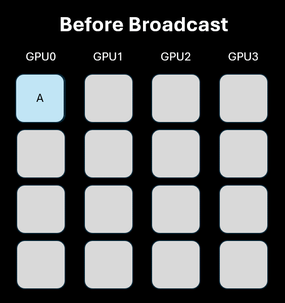
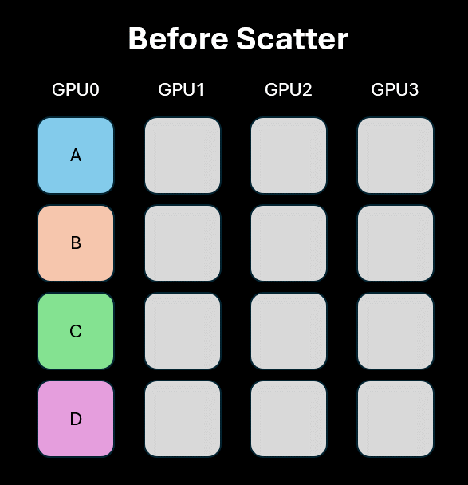
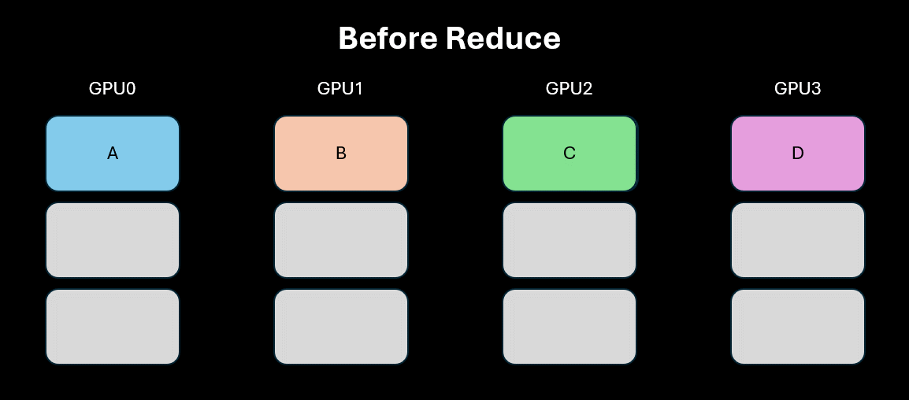
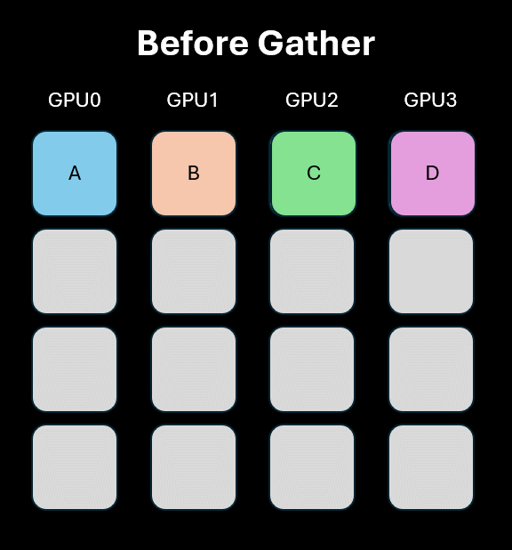
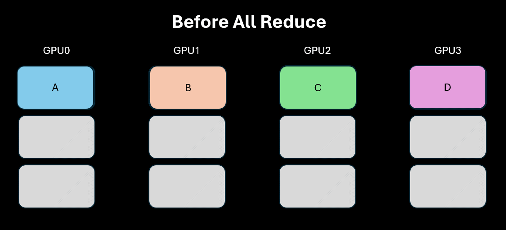
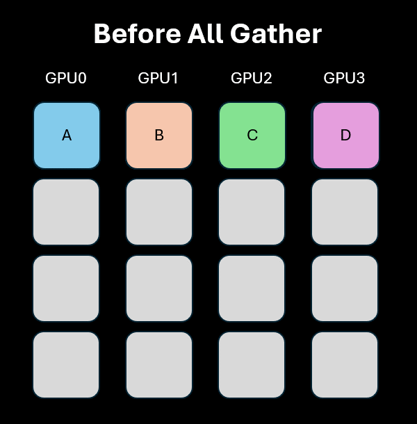
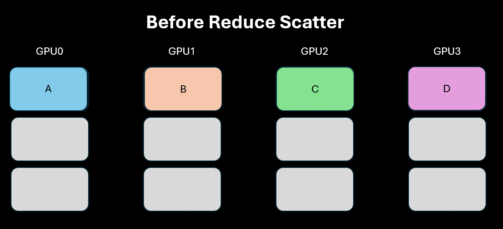

```{=html}
<style>
img {
  max-width: 100%;
  height: auto;
}
pre code {
  white-space: pre-wrap;
  word-wrap: break-word;
}
</style>
```

This article is part of a series about distributed AI across multiple GPUs:

- [Part 1: Understanding the Host and Device Paradigm](../2025-09-21-first-steps-gpu/)
- **Part 2: Point-to-Point and Collective Operations** (this article)
- [Part 3: How GPUs Communicate](../2025-10-01-how-gpus-communicate/)
- [Part 4: Gradient Accumulation & Distributed Data Parallelism (DDP)](../2025-10-12-ddp/)
- [Part 5: ZeRO](../2025-10-25-ZeRO/)
- Part 6: Tensor Parallelism *(coming soon)*

# Introduction

In the previous post, we established the host-device paradigm and introduced the concept of ranks for multi-GPU workloads. Now, we'll explore the specific communication patterns provided by PyTorch's `torch.distributed` module to coordinate work and exchange data between these ranks. These operations, known as **collectives**, are the building blocks of distributed workloads.

Although PyTorch exposes these operations, it ultimately calls a backend framework that actually implements the communication. For NVIDIA GPUs, it's `NCCL` (NVIDIA Collective Communications Library), while for AMD it's RCCL (ROCm Communication Collectives Library).

`NCCL` implements multi-GPU and multi-node communication primitives optimized for NVIDIA GPUs and networking. It automatically detects the current topology (communication channels like PCIe, NVLink, InfiniBand) and selects the most efficient one.

> Disclaimer 1: Since NVIDIA GPUs are the most common, we'll focus on the `NCCL` backend for this post.

> Disclaimer 2: For brevity, the code presented below only provides the main arguments of each method instead of all available arguments.

> Disclaimer 3: For simplicity, we're not showing the memory deallocation of tensors, but operations like `scatter` will not automatically free the memory of the source rank (if you don't understand what I mean, that's fine, it'll become clear very soon).

# Communication: Blocking vs. Non-Blocking

To work together, GPUs must exchange data. The CPU initiates the communication by enqueuing NCCL kernels into CUDA streams (if you don't know what CUDA Streams are, check out the [first blog post](../2025-09-21-first-steps-gpu/) of this series), but the actual data transfer happens directly between GPUs over the interconnect, bypassing the CPU's main memory entirely. Ideally, the GPUs are connected with a high-speed interconnect like NVLink or InfiniBand (these interconnects are covered in the [third post of this series](../2025-10-01-how-gpus-communicate/)).

This communication may be synchronous (blocking) or asynchronous (non-blocking), which we explore below.

### Synchronous (Blocking) Communication

* **Behavior:** When you call a synchronous communication method, the host process **stops and waits** until the NCCL kernel is successfully enqueued on the current active CUDA stream. Once enqueued, the function returns. This is usually simple and reliable. Note that the host is not waiting for the transfer to complete, just for the operation to be enqueued. However, it blocks **that specific stream from moving on to the next operation** until the NCCL kernel is executed to completion.

### Asynchronous (Non-Blocking) Communication

* **Behavior:** When you call an asynchronous communication method, the call returns **immediately**, and the enqueuing operation happens in the background. It doesn't enqueue into the current active stream, but rather to a dedicated internal NCCL stream per device. This allows your CPU to continue with other tasks, a technique known as **overlapping computation with communication**. The asynchronous API is more complex because it can lead to undefined behavior if you don't properly use `.wait()` (explained below) and modify data while it's being transferred. However, mastering it is key to unlocking maximum performance in large-scale distributed training.

# Point-to-Point (One-to-One)

---

These operations are not considered **collectives**, but they are foundational communication primitives. They facilitate direct data transfer between two specific ranks and are fundamental for tasks where one GPU needs to send specific information to another.

* **Synchronous (Blocking)**: The host process waits for the operation to be enqueued to the CUDA stream before proceeding. The kernel is enqueued into the current active stream.
  * `torch.distributed.send(tensor, dst)`: Sends a tensor to a specified destination rank.
  * `torch.distributed.recv(tensor, src)`: Receives a tensor from a source rank. The receiving tensor must be pre-allocated with the correct shape and `dtype`.

* **Asynchronous (Non-Blocking)**: The host process initiates the enqueue operation and immediately continues with other tasks. The kernel is enqueued into a dedicated internal NCCL stream per device, which allows for overlapping communication with computation. These operations return a `request` (technically a `Work` object) that can be used to track the enqueuing status.
  * `request = torch.distributed.isend(tensor, dst)`: Initiates an asynchronous send operation.
  * `request = torch.distributed.irecv(tensor, src)`: Initiates an asynchronous receive operation.
  * `request.wait()`: Blocks the host only until the operation has been successfully enqueued on the CUDA stream. However, it does block the currently active CUDA stream from executing later kernels until this specific asynchronous operation completes.
  * `request.wait(timeout)`: If you provide a timeout argument, the host behavior changes. It will block the CPU thread until the NCCL work completes or times out (raising an exception). In normal cases, users do not need to set the timeout.
  * `request.is_completed()`: Returns `True` if the operation has been successfully enqueued onto a CUDA stream. It may be used for polling. It does not guarantee that the actual data has been transferred.

When PyTorch launches an NCCL kernel, it automatically inserts a dependency between your current active stream and the NCCL stream. This means the NCCL stream won't start until all previously enqueued work on the active stream finishes — guaranteeing the tensor being sent already holds the final values.

Similarly, calling `req.wait()` inserts a dependency in the other direction. Any work you enqueue on the current stream after `req.wait()` won't execute until the NCCL operation completes, so you can safely use the received tensors.

### Major "Gotchas" in NCCL

While `send` and `recv` are labeled "synchronous," their behavior in NCCL can be confusing. A synchronous call on a CUDA tensor blocks the host CPU thread only until the data transfer kernel is enqueued to the stream, **not** until the data transfer completes. The CPU is then free to enqueue other tasks.

There is an exception: the very first call to `torch.distributed.recv()` in a process is truly blocking and waits for the transfer to finish, likely due to internal NCCL warm-up procedures. Subsequent calls will only block until the operation is enqueued.

Consider this example where `rank 1` hangs because the CPU tries to access a tensor that the GPU has not yet received:

```python
rank = torch.distributed.get_rank()
if rank == 0:
   t = torch.tensor([1,2,3], dtype=torch.float32, device=device)
   # torch.distributed.send(t, dst=1) # No send operation is performed
else: # rank == 1 (assuming only 2 ranks)
   t = torch.empty(3, dtype=torch.float32, device=device)
   torch.distributed.recv(t, src=0) # Blocks only until enqueued (after first run)
   print("This WILL print if NCCL is warmed-up")
   print(t) # CPU needs data from GPU, causing a block
   print("This will NOT print")
```

The CPU process at `rank 1` gets stuck on `print(t)` because it triggers a host-device synchronization to access the tensor's data, which never arrives.

> If you run this code multiple times, notice that `This WILL print if NCCL is warmed-up` will not get printed in the later executions, since the CPU is still stuck at `print(t)`.

# Collectives

---

Every collective operation function supports both sync and async operations through the `async_op` argument. It defaults to False, meaning synchronous operations.

## One-to-All Collectives

These operations involve one rank sending data to all other ranks in the group.

### Broadcast

* **`torch.distributed.broadcast(tensor, src)`**: Copies a tensor from a single source rank (`src`) to all other ranks. Every process ends up with an identical copy of the tensor. The `tensor` parameter serves two purposes: (1) when the rank of the process matches the `src`, the `tensor` is the data being sent; (2) otherwise, `tensor` is used to save the received data.

    ```python
    rank = torch.distributed.get_rank()
    if rank == 0: # source rank
      tensor = torch.tensor([1,2,3], dtype=torch.int64, device=device)
    else: # destination ranks
      tensor = torch.empty(3, dtype=torch.int64, device=device)
    torch.distributed.broadcast(tensor, src=0)
    ```

{height=400}

### Scatter

* **`torch.distributed.scatter(tensor, scatter_list, src)`**: Distributes chunks of data from a source rank across all ranks. The `scatter_list` on the source rank contains multiple tensors, and each rank (including the source) receives one tensor from this list into its `tensor` variable. The destination ranks just pass `None` for the `scatter_list`.

    ```python
    # The scatter_list must be None for all non-source ranks.
    scatter_list = None if rank != 0 else [torch.tensor([i, i+1]).to(device) for i in range(0,4,2)]
    tensor = torch.empty(2, dtype=torch.int64).to(device)
    torch.distributed.scatter(tensor, scatter_list, src=0)
    print(f'Rank {rank} received: {tensor}')
    ```

{height=400}

## All-to-One Collectives

These operations gather data from all ranks and consolidate it onto a single destination rank.

### Reduce

* **`torch.distributed.reduce(tensor, dst, op)`**: Takes a tensor from each rank, applies a reduction operation (like `SUM`, `MAX`, `MIN`), and stores the final result on the destination rank (`dst`) only.

    ```python
    rank = torch.distributed.get_rank()
    tensor = torch.tensor([rank+1, rank+2, rank+3], device=device)
    torch.distributed.reduce(tensor, dst=0, op=torch.distributed.ReduceOp.SUM)
    print(tensor)
    ```

{height=300}

### Gather

* **`torch.distributed.gather(tensor, gather_list, dst)`**: Gathers a tensor from every rank into a list of tensors on the destination rank. The `gather_list` must be a list of tensors (correctly sized and typed) on the destination and `None` everywhere else.

    ```python
    # The gather_list must be None for all non-destination ranks.
    rank = torch.distributed.get_rank()
    world_size = torch.distributed.get_world_size()
    gather_list = None if rank != 0 else [torch.zeros(3, dtype=torch.int64).to(device) for _ in range(world_size)]
    t = torch.tensor([0+rank, 1+rank, 2+rank], dtype=torch.int64).to(device)
    torch.distributed.gather(t, gather_list, dst=0)
    print(f'After op, Rank {rank} has: {gather_list}')
    ```

The variable `world_size` is the total number of ranks. It can be obtained with `torch.distributed.get_world_size()`. But don't worry about implementation details for now, the most important thing is to grasp the concepts.



## All-to-All Collectives

In these operations, every rank both sends and receives data from all other ranks.

### All Reduce

* **`torch.distributed.all_reduce(tensor, op)`**: Same as `reduce`, but the result is stored on *every* rank instead of just one destination.

  ```python
  # Example for torch.distributed.all_reduce
  rank = torch.distributed.get_rank()
  tensor = torch.tensor([rank+1, rank+2, rank+3], dtype=torch.float32, device=device)
  torch.distributed.all_reduce(tensor, op=torch.distributed.ReduceOp.SUM)
  print(f"Rank {rank} after all_reduce: {tensor}")
  ```

{height=300}

### All Gather

* **`torch.distributed.all_gather(tensor_list, tensor)`**: Same as `gather`, but the gathered list of tensors is available on *every* rank.

  ```python
  # Example for torch.distributed.all_gather
  rank = torch.distributed.get_rank()
  world_size = torch.distributed.get_world_size()
  input_tensor = torch.tensor([rank], dtype=torch.float32, device=device)
  tensor_list = [torch.empty(1, dtype=torch.float32, device=device) for _ in range(world_size)]
  torch.distributed.all_gather(tensor_list, input_tensor)
  print(f"Rank {rank} gathered: {[t.item() for t in tensor_list]}")
  ```

{height=400}

### Reduce Scatter

* **`torch.distributed.reduce_scatter(output, input_list)`**: Equivalent of performing a reduce operation on a list of tensors and then scattering the results. Each rank receives a different part of the reduced output.

    ```python
    # Example for torch.distributed.reduce_scatter
    rank = torch.distributed.get_rank()
    world_size = torch.distributed.get_world_size()
    input_list = [torch.tensor([rank + i], dtype=torch.float32, device=device) for i in range(world_size)]
    output = torch.empty(1, dtype=torch.float32, device=device)
    torch.distributed.reduce_scatter(output, input_list, op=torch.distributed.ReduceOp.SUM)
    print(f"Rank {rank} received reduced value: {output.item()}")
    ```

{height=300}

# Synchronization

---

The two most frequently used operations are `request.wait()` and `torch.cuda.synchronize()`. It's crucial to understand the difference between these two:

* `request.wait()`: This is used for asynchronous operations. It synchronizes the currently active CUDA stream for that operation, ensuring the stream waits for the communication to complete before proceeding. In other words, it blocks the currently active CUDA stream until the data transfer finishes. On the host side, it only causes the host to wait until the kernel is enqueued; the host does **not** wait for the data transfer to complete.

* `torch.cuda.synchronize()`: This is a more forceful command that pauses the host CPU thread until **all** previously enqueued tasks on the GPU have finished. It guarantees that the GPU is completely idle before the CPU moves on, but it can create performance bottlenecks if used improperly. Whenever you need to perform benchmark measurements, you should use this to ensure you capture the exact moment the GPUs are done.

# Conclusion

Congratulations on making it to the end! In this post, you learned about:

- Point-to-Point Operations
- Sync and Async in NCCL
- Collective operations
- Synchronization methods

**In the [next blog post](../2025-10-01-how-gpus-communicate/) we'll dive into PCIe, NVLink, and other mechanisms that enable communication in a distributed setting!**

# References
- [PyTorch Docs](https://docs.pytorch.org/docs/stable/distributed.html)
- [NCCL P2P Docs](https://docs.nvidia.com/deeplearning/nccl/user-guide/docs/api/p2p.html)
