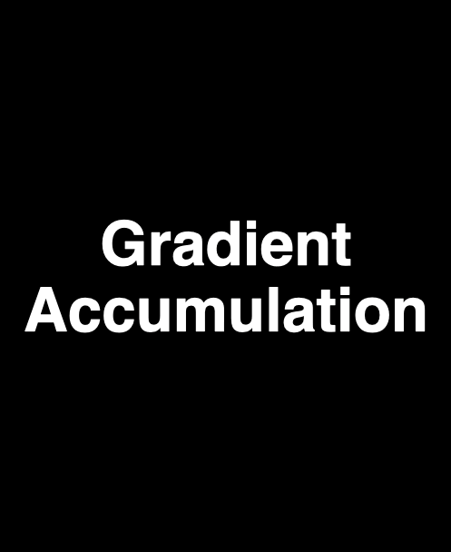
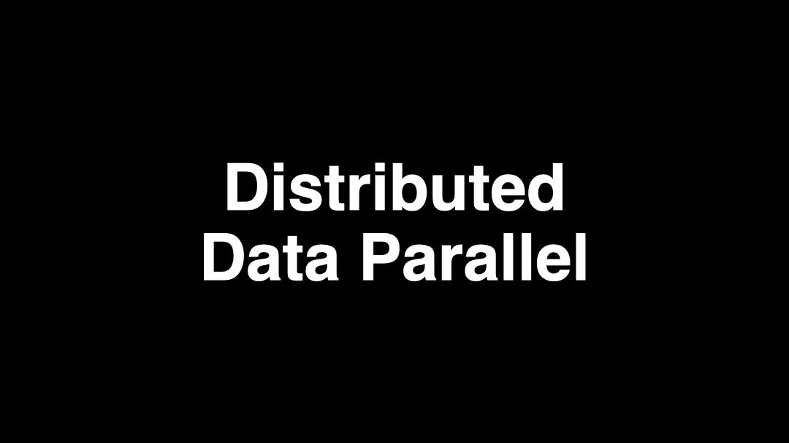

```{=html}
<style>
img {
  max-width: 100%;
  height: auto;
}
pre code {
  white-space: pre-wrap;
  word-wrap: break-word;
}
</style>
```

This article is part of a series about distributed AI across multiple GPUs:

- [Part 1: Understanding the Host and Device Paradigm](../2025-09-21-the-host-device-paradigm/)
- [Part 2: Point-to-Point and Collective Operations](../2025-09-23-torch-distributed-operations/)
- [Part 3: How GPUs Communicate](../2025-10-01-how-gpus-communicate/)
- **Part 4: Gradient Accumulation & Distributed Data Parallelism (DDP)** (this article)
- [Part 5: ZeRO](../2025-10-25-ZeRO/)
- Part 6: Tensor Parallelism *(coming soon)*

# Introduction

Distributed Data Parallelism (DDP) is the first parallelization method we’ll look at. It's the baseline approach that's **always** used in distributed training settings, and it's commonly combined with other parallelization techniques.

# A Quick Neural Network Refresher

Training a neural network means running a forward pass, calculating the loss, backpropagating the gradients of each weight with respect to the loss function, and finally updating weights (what we call an optimization step). In PyTorch, it typically looks like this:

```python
import torch

def training_loop(
    model: torch.nn.Module,
    dataloader: torch.utils.data.DataLoader,
    optimizer: torch.optim.Optimizer,
    loss_fn: callable,
):
    for i, batch in enumerate(dataloader):
        inputs, targets = batch
        output = model(inputs)  # Forward pass
        loss = loss_fn(output, targets)  # Compute loss
        loss.backward()  # Backward pass (compute gradients)
        optimizer.step()  # Update weights
        optimizer.zero_grad()  # Clear gradients for the next step
```

Performing the optimization step on large amounts of training data generally gives more accurate gradient estimates, leading to smoother training and potentially faster convergence. So ideally we would be taking each step after computing the gradients based on the entire training dataset. In practice, that’s rarely feasible in Deep Learning scenarios, as it would take too long to compute. Instead, we work with small chunks like *mini-batches* and *micro-batches*.

- **Batch:** Refers to the entire training set used for one optimization step.
- **Mini-batch:** Refers to a small subset of the training data used for one optimization step.
- **Micro-batch:** Refers to a subset of the mini-batch, we combine multiple micro-batches for one optimization step.

This is where Gradient Accumulation and Data Parallelism come into play. Although we don't use the entire dataset for each step, we can use these techniques to substantially increase our mini-batch size.

# Gradient Accumulation

Here's how it works: pick a large mini-batch that won't fit in GPU memory, but then split it into *micro-batches* that do fit. For each micro-batch, run forward and backward passes, adding (accumulating) the computed gradients. Once all micro-batches are processed, perform a single optimization step using the averaged gradients.

**Notice Gradient Accumulation isn't a parallelization technique and doesn't require multiple GPUs.**

{height=700}

Implementing Gradient Accumulation from scratch is straightforward. Here’s what it looks like in a simple training loop:

```python
import torch

def training_loop(
    model: torch.nn.Module,
    dataloader: torch.utils.data.DataLoader,
    optimizer: torch.optim.Optimizer,
    loss_fn: callable,
    grad_accum_steps: int,
):
    for i, batch in enumerate(dataloader):
        inputs, targets = batch
        output = model(inputs)
        loss = loss_fn(output, targets)
        loss.backward()  # Gradients get accumulated (summed)

        # Only update weights after `grad_accum_steps` micro-batches
        if (i+1) % grad_accum_steps == 0:  # i+1 to avoid a step in the first iteration when i=0
            optimizer.step()
            optimizer.zero_grad()
```

Notice we're _**sequentially**_ performing multiple forward and backward passes before each optimization step, which requires longer training times. It would be nice if we could speed this up by processing multiple micro-batches in _**parallel**_... that's exactly what DDP does!

# Distributed Data Parallelism (DDP)

For a fairly small number of GPUs (up to ~8) DDP scales almost linearly, which is optimal. That means that if you double the number of GPUs, you can almost halve the training time (we already discussed [Linear Scaling](../2025-10-01-how-gpus-communicate/#understanding-linear-scaling) previously).

With DDP, multiple GPUs work together to process a larger effective mini-batch, handling each micro-batch in parallel. The workflow looks like this:

1. Split the mini-batch across GPUs.
2. Each GPU runs its own forward and backward passes to compute gradients for its own data shard (micro-batch).
3. Use an _**All-Reduce**_ operation (we previously learned about it in [Collective operations](../2025-09-23-torch-distributed-operations/#collectives)) to average gradients across all GPUs.
4. Each GPU applies the same weight updates, keeping models in perfect sync.

This lets us train with much larger effective mini-batch sizes, leading to more stable training and potentially faster convergence.

{height=700}

## Implementing DDP from scratch in PyTorch

Let's do this step-by-step. In this first iteration, we're only syncing the gradients.

```python
import torch


class DDPModelWrapper:
    def __init__(self, model: torch.nn.Module):
        self.model = model

    def __call__(self, *args, **kwargs):
        return self.model(*args, **kwargs)

    def sync_gradients(self):
        # Iterate over parameter matrices in the model
        for param in self.model.parameters():  
            # Some parameters might be frozen and don't have gradients
            if param.grad is not None:
                # We sum and then divide since torch.distributed doesn't have an average operation
                torch.distributed.all_reduce(param.grad.data, op=torch.distributed.ReduceOp.SUM)
                # Assuming each GPU received an equally sized mini-batch, we can average
                # the gradients dividing by the number of GPUs (aka world size)
                # By default the loss function already averages over the mini-batch size
                param.grad.data /= torch.distributed.get_world_size()
```

Before we start training, we obviously need our model to be the same across all GPUs, otherwise we would be training different models! Let's improve our implementation by checking that all weights are identical during instantiation (if you don't know what ranks are, check the [first blog post](../2025-09-21-the-host-device-paradigm/) of the series).

```python
import torch


class DDPModelWrapper:
    def __init__(self, model: torch.nn.Module):
        self.model = model
        for param in self.model.parameters():
            # We create a new tensor so it can receive the broadcast
            rank_0_param = param.data.clone()
            # Initially rank_0_param contains the values for the current rank
            torch.distributed.broadcast(rank_0_param, src=0)
            # After the broadcast rank_0_param variable is overwritten with the parameters from rank_0
            if not torch.equal(param.data, rank_0_param):  # Now we compare rank_x with rank_0
                raise ValueError("Model parameters are not the same across all processes.")

    def __call__(self, *args, **kwargs):
        return self.model(*args, **kwargs)

    def sync_gradients(self):
        for param in self.model.parameters():  
            if param.grad is not None:  
                torch.distributed.all_reduce(param.grad.data, op=torch.distributed.ReduceOp.SUM)
                param.grad.data /= torch.distributed.get_world_size()
```

# Combining DDP with GA

You can combine DDP with GA to achieve even larger effective batch sizes. This is particularly useful when your model is so large that only a few samples fit per GPU.

The key benefit is **reduced communication overhead**: instead of syncing gradients after every batch, you only sync once per `grad_accum_steps` batches. This means:

- **Global effective batch size** = `num_gpus × micro_batch_size × grad_accum_steps`
- Fewer synchronization points = less time spent on inter-GPU communication

A training loop using our `DDPModelWrapper` with Gradient Accumulation looks like this:

```python
def training_loop(
    ddp_model: DDPModelWrapper,
    dataloader: torch.utils.data.DataLoader,
    optimizer: torch.optim.Optimizer,
    loss_fn: callable,
    grad_accum_steps: int,
):
    for i, batch in enumerate(dataloader):
        inputs, targets = batch
        output = ddp_model(inputs)
        loss = loss_fn(output, targets)
        loss.backward()

        if (i+1) % grad_accum_steps == 0:
            # Must sync gradients across GPUs *BEFORE* the optimization step
            ddp_model.sync_gradients()
            optimizer.step()
            optimizer.zero_grad()
```

# Pro-tips and advanced usage

- **Use data prefetching.** You can speed up training by loading the next batch of data while the current one is being processed. PyTorch's `DataLoader` provides a `prefetch_factor` argument that controls how many batches to prefetch in the background. Properly leveraging prefetching with CUDA can be a bit tricky, so we'll leave it for a future post.

- **Don't max out GPU memory.** Counter-intuitively, leaving some free memory can lead to faster training throughput. When you leave at least ~15% of GPU memory free, the GPU can better manage memory by avoiding fragmentation.

- **PyTorch DDP overlaps communication with computation.** By default, DDP communicates gradients as they're computed during backpropagation rather than waiting for the full backward pass to finish. Here's how:

  - PyTorch organizes model gradients into buckets of `bucket_cap_mb` megabytes. During the backward pass, PyTorch marks gradients as ready for reduction as they're computed. Once all gradients in a bucket are ready, DDP kicks off an asynchronous `allreduce` to average those gradients across all ranks. The `loss.backward()` call returns only after all `allreduce` operations have completed, so immediately calling `opt.step()` is safe.

  - The `bucket_cap_mb` parameter creates a tradeoff: smaller values trigger more frequent `allreduce` operations, but each communication kernel launch incurs some overhead that can hurt performance. Larger values reduce communication frequency but also reduce overlap; at the extreme, if buckets are too large, you're waiting for the entire backward pass to finish before communicating. The optimal value depends on your model architecture and hardware, so profile with different values to find what works best.

](https://user-images.githubusercontent.com/16999635/72401724-d296d880-371a-11ea-90ab-737f86543df9.png)

- Here's a complete PyTorch implementation of DDP:

```python
"""
Launch with:
  torchrun --nproc_per_node=NUM_GPUS ddp.py
"""
import torch
import torch.nn as nn
import torch.distributed as dist
from torch.nn.parallel import DistributedDataParallel as DDP
from torch.utils.data import DataLoader, TensorDataset
from torch.utils.data.distributed import DistributedSampler
from torch import optim


class ToyModel(nn.Module):
    def __init__(self):
        super().__init__()
        self.net = nn.Sequential(
            nn.Linear(1024, 1024), nn.ReLU(),
            nn.Linear(1024, 1024), nn.ReLU(),
            nn.Linear(1024, 256),
        )

    def forward(self, x):
        return self.net(x)


def train():
    dist.init_process_group(backend="nccl")
    rank = dist.get_rank()
    torch.cuda.set_device(rank)
    device = torch.device(f"cuda:{rank}")

    # Create dummy dataset
    x_data = torch.randn(1000, 1024)
    y_data = torch.randn(1000, 256)
    dataset = TensorDataset(x_data, y_data)

    # DistributedSampler ensures each rank gets different data
    sampler = DistributedSampler(dataset, shuffle=True)
    dataloader = DataLoader(dataset, batch_size=64, sampler=sampler)

    model = ToyModel().to(device)

    # gradient_as_bucket_view: avoids an extra grad tensor copy per bucket.
    ddp_model = DDP(
        model,
        device_ids=[rank],
        bucket_cap_mb=25,
        gradient_as_bucket_view=True,
    )

    optimizer = optim.AdamW(ddp_model.parameters(), lr=1e-3)
    loss_fn = nn.MSELoss()

    for epoch in range(2):
        sampler.set_epoch(epoch)  # Ensures different shuffling each epoch

        for batch_idx, (x, y) in enumerate(dataloader):
            x, y = x.to(device), y.to(device)

            optimizer.zero_grad()
            output = ddp_model(x)
            loss = loss_fn(output, y)

            # Backward automatically overlaps with allreduce per bucket.
            # By the time this returns, all allreduce ops are done.
            loss.backward()
            optimizer.step()

            if rank == 0 and batch_idx % 5 == 0:
                print(f"epoch {epoch}  batch {batch_idx}  loss={loss.item():.4f}")

    dist.destroy_process_group()


if __name__ == "__main__":
    train()
```

- Here's a complete PyTorch implementation combining DDP with GA:
```python
"""
Launch with:
  torchrun --nproc_per_node=NUM_GPUS ddp_ga.py
"""
import torch
import torch.nn as nn
import torch.distributed as dist
from torch.nn.parallel import DistributedDataParallel as DDP
from torch.utils.data import DataLoader, TensorDataset
from torch.utils.data.distributed import DistributedSampler
from torch import optim
from contextlib import nullcontext


class ToyModel(nn.Module):
    def __init__(self):
        super().__init__()
        self.net = nn.Sequential(
            nn.Linear(1024, 1024), nn.ReLU(),
            nn.Linear(1024, 1024), nn.ReLU(),
            nn.Linear(1024, 256),
        )

    def forward(self, x):
        return self.net(x)


def train():
    dist.init_process_group(backend="nccl")
    rank = dist.get_rank()
    torch.cuda.set_device(rank)
    device = torch.device(f"cuda:{rank}")

    # Create dummy dataset
    x_data = torch.randn(1000, 1024)
    y_data = torch.randn(1000, 256)
    dataset = TensorDataset(x_data, y_data)

    # DistributedSampler ensures each rank gets different data
    sampler = DistributedSampler(dataset, shuffle=True)
    dataloader = DataLoader(dataset, batch_size=16, sampler=sampler)

    model = ToyModel().to(device)

    ddp_model = DDP(
        model,
        device_ids=[rank],
        bucket_cap_mb=25,
        gradient_as_bucket_view=True,
    )

    optimizer = optim.AdamW(ddp_model.parameters(), lr=1e-3)
    loss_fn = nn.MSELoss()

    ACCUM_STEPS = 4

    for epoch in range(2):
        sampler.set_epoch(epoch)  # Ensures different shuffling each epoch

        optimizer.zero_grad()
        for batch_idx, (x, y) in enumerate(dataloader):
            x, y = x.to(device), y.to(device)

            is_last_micro_step = (batch_idx + 1) % ACCUM_STEPS == 0

            # no_sync() suppresses allreduce on accumulation steps.
            # On the last microstep we exit no_sync() so DDP fires
            # the allreduce overlapped with that backward pass.
            ctx = ddp_model.no_sync() if not is_last_micro_step else nullcontext()

            with ctx:
                output = ddp_model(x)
                loss = loss_fn(output, y) / ACCUM_STEPS
                loss.backward()

            if is_last_micro_step:
                optimizer.step()
                optimizer.zero_grad()

                if rank == 0:
                    print(f"epoch {epoch}  batch {batch_idx}  loss={loss.item() * ACCUM_STEPS:.4f}")

    dist.destroy_process_group()


if __name__ == "__main__":
    train()
```

# Conclusion

Congratulations on making it to the end! In this post you learned about:

- The importance of large batch sizes
- How Gradient Accumulation works and its limitations
- The DDP workflow and its benefits
- How to implement GA and DDP from scratch in PyTorch
- How to combine GA and DDP

**In the [next article](../2025-10-25-ZeRO/), we'll explore ZeRO (Zero Redundancy Optimizer), a more advanced technique that builds upon DDP to further optimize VRAM memory usage.**

# References
- [PyTorch DDP tutorial](https://docs.pytorch.org/docs/stable/notes/ddp.html)
- [PyTorch DDP documentation](https://docs.pytorch.org/docs/stable/generated/torch.nn.parallel.DistributedDataParallel.html#torch.nn.parallel.DistributedDataParallel)
