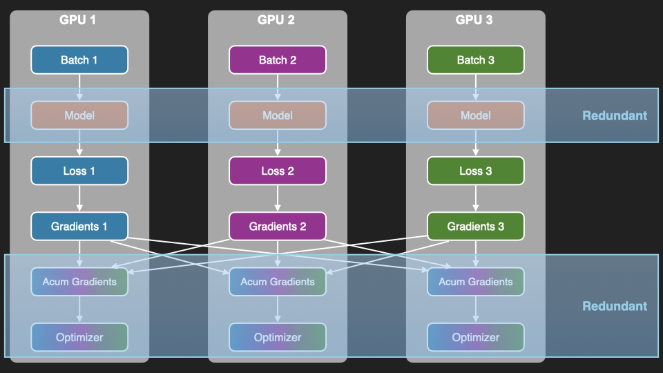
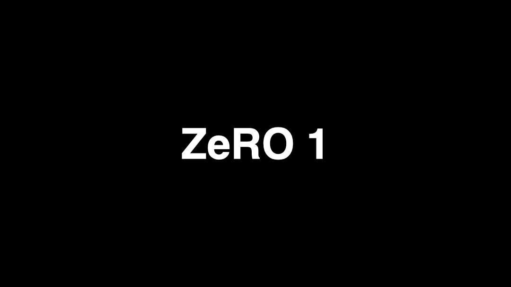
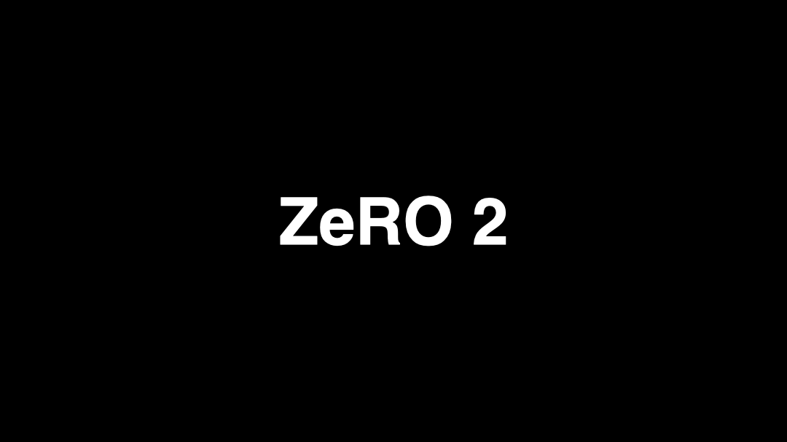

This article is part of a series about distributed AI across multiple GPUs:

- [Part 1: Understanding the Host and Device Paradigm](../2025-09-21-the-host-device-paradigm/)
- [Part 2: Point-to-Point and Collective Operations](../2025-09-23-torch-distributed-operations/)
- [Part 3: How GPUs Communicate](../2025-10-01-how-gpus-communicate/)
- [Part 4: Gradient Accumulation & Distributed Data Parallelism (DDP)](../2025-10-12-ddp/)
- **Part 5: ZeRO** (this article)
- Part 6: Tensor Parallelism *(coming soon)*

# Introduction

In the previous post, we saw how Distributed Data Parallelism (DDP) speeds up training by splitting batches across GPUs. DDP solves the throughput problem, but it introduces a new challenge: **memory redundancy**.

In vanilla DDP, every GPU holds a complete copy of the model parameters, gradients, and optimizer states. For large models like GPT-3 (175B parameters), this redundancy becomes a big waste of precious VRAM.



ZeRO (Zero Redundancy Optimizer) solves this. There are three levels:

- **ZeRO-1** partitions only optimizer states
- **ZeRO-2** partitions optimizer states + gradients
- **ZeRO-3** partitions optimizer states + gradients + model parameters

ZeRO isn't a parallelism technique because all GPUs still run the same forward and backward passes. It's a **memory optimization** strategy that eliminates redundancy across GPUs, letting you train larger models on the same hardware.


# The Memory Problem in DDP

Let's break down what actually consumes memory during training. For a model with $P$ parameters:

- **Model Parameters**: $P$ values (the weights of your neural network)
- **Gradients**: $P$ values (one gradient per parameter)
- **Optimizer States (Adam)**: $2P$ values (first moment $m$ and second moment $v$ for each parameter)
- **Activations**: Intermediate outputs stored during forward pass for use in backward pass

The first three scale with model size and are **redundant across GPUs** in DDP. Activations scale with batch size, sequence length, and # neurons, and are **unique per GPU** since each GPU processes different data. ZeRO doesn't touch activation memory.

Let's calculate the memory usage for a 7B-parameter model using Adam and FP32:

- Parameters: $7B \times 4$ bytes = 28 GB
- Gradients: $7B \times 4$ bytes = 28 GB
- Optimizer states: $7B \times 2 \times 4$ bytes = 56 GB
- **Memory per GPU in DDP: $112$ GB**

Activations add significant memory on top of this, but since they're unique per GPU, ZeRO can't partition them. Techniques like **activation checkpointing** can help, it discards some activations and then recomputes them as needed during the backward pass. But that's outside the scope of this article.

Let's understand how ZeRO works by implementing it from the ground up, starting with ZeRO-1 and working our way to ZeRO-3.

# ZeRO-1: Optimizer State Partitioning

In ZeRO-1, only the **optimizer states** are partitioned. Each GPU:

- Still holds the **full model parameters and gradients**
- Stores only **1/N of the optimizer states** (N = number of GPUs)
- Updates only the corresponding **1/N of the parameters**

This is the sequence actions taken during training:

1. **Forward pass:** each GPU processes its own micro-batch
2. **Backward pass:** compute gradients
3. **`all-reduce` gradients:** every GPU gets the all gradients
4. **Optimizer step:** Each GPU updates its parameter partition
5. **`all-gather` parameters:** sync the updated model across GPUs



Here's a simplified implementation:

```python
import torch
import torch.distributed as dist


class ZeRO_1:
    def __init__(self, model, optimizer_cls):
        self.model = model
        self.rank = dist.get_rank()
        self.world_size = dist.get_world_size()

        self.param_shards = list()  # each rank holds only its shard of the optimizer states
        self.param_metadata = list()  # metadata to reconstruct shards

        for param in self.model.parameters():
            original_shape = param.data.shape
            flat = param.data.view(-1)
            numel = flat.numel()

            remainder = numel % self.world_size
            pad_size = (self.world_size - remainder) % self.world_size
            padded_numel = numel + pad_size
            shard_size = padded_numel // self.world_size

            shard_start = self.rank * shard_size
            shard_end = shard_start + shard_size

            self.param_metadata.append(
                {
                    "original_shape": original_shape,
                    "numel": numel,
                    "padded_numel": padded_numel,
                    "shard_size": shard_size,
                    "shard_start": shard_start,
                    "shard_end": shard_end,
                }
            )

            if pad_size > 0:
                flat_padded = torch.cat([flat, flat.new_zeros(pad_size)])
            else:
                flat_padded = flat

            shard = flat_padded[shard_start:shard_end].clone()
            shard.requires_grad_(True)
            self.param_shards.append(shard)

        self.optimizer = optimizer_cls(self.param_shards)

    def training_step(self, inputs, targets, loss_fn):
        output = self.model(inputs) # forward
        loss = loss_fn(output, targets) # compute loss
        loss.backward() # backward

        self._sync_gradients()  # all-reduce gradients across GPUs
        self.optimizer.step() # update local shard of parameters
        self._sync_params() # all gather model params

        # clear gradients for the next step
        for param in self.model.parameters():
            param.grad = None

    def _sync_gradients(self):
        for idx, param in enumerate(self.model.parameters()):
            meta = self.param_metadata[idx]

            dist.all_reduce(param.grad, op=dist.ReduceOp.SUM)
            param.grad /= self.world_size

            self.param_shards[idx].grad = param.grad.view(-1)[meta["shard_start"]:meta["shard_end"]]

    def _sync_params(self):
        for idx, param in enumerate(self.model.parameters()):
            meta = self.param_metadata[idx]

            full_flat = torch.empty(meta["padded_numel"], device=param.device, dtype=param.dtype)
            dist.all_gather_into_tensor(
                output_tensor=full_flat,
                input_tensor=self.param_shards[idx].data,
            )
            
            reconstructed = full_flat[:meta["numel"]].view(meta["original_shape"])
            param.data.copy_(reconstructed)
```

Notice that the `all-reduce` syncs *all* gradients, but each GPU only uses the gradients for its own parameter partition, it's overcommunicating. ZeRO-2 fixes this by sharding the gradients too.

In practice, you'd never use ZeRO-1 as ZeRO-2 gives you better memory savings at essentially the same cost. But it's still worth going over it for learning purposes.

**Memory with ZeRO-1, 7B model, 8 GPUs:**

- Parameters: $28$ GB (fully replicated)
- Gradients: $28$ GB (fully replicated)
- Optimizer states: $56 \text{ GB} / 8 = 7 \text{ GB per GPU}$
- **Total per GPU: $63$ GB** (down from $112$ GB)


# ZeRO-2: Gradient Partitioning

ZeRO-2 partitions both optimizer states and **gradients**. Since each GPU only updates a partition of parameters, it only needs the corresponding gradients.

ZeRO-1 uses `all-reduce`, which gives every GPU all the gradients. ZeRO-2 replaces this with `reduce-scatter`, each GPU receives only the gradients it actually needs. This saves both memory and communication bandwidth.

Training steps:

1. **Forward pass:** each GPU processes its own micro-batch
2. **Backward pass:** compute gradients
3. **`reduce-scatter` gradients:** each GPU gets only its partition
4. **Optimizer step:** Each GPU updates its parameter partition
5. **`all-gather` parameters:** sync the updated model across GPUs



The implementation is very similar to ZeRO-1, but the gradient synchronization step uses `reduce-scatter` instead of `all-reduce`:

```python
class ZeRO_2(ZeRO_1):
    def _sync_gradients(self):
        """
        ZeRO-2: reduce_scatter gradients so each rank receives only
        the gradient shard for the parameters it owns
        """
        for idx, param in enumerate(self.model.parameters()):
            meta = self.param_metadata[idx]

            grad_flat = param.grad.view(-1)
            pad_size = meta["padded_numel"] - meta["numel"]
            if pad_size > 0:
                grad_flat = torch.cat([grad_flat, grad_flat.new_zeros(pad_size)])

            # Each rank receives only its own shard of the reduced gradient
            grad_shard = torch.empty(
                meta["shard_size"], device=param.device, dtype=param.dtype
            )
            dist.reduce_scatter_tensor(
                output=grad_shard,
                input=grad_flat.contiguous(),
                op=dist.ReduceOp.SUM,
            )
            grad_shard /= self.world_size

            self.param_shards[idx].grad = grad_shard
```

**But wait, if every GPU computes all gradients during backprop, how does this actually save VRAM?** 
Here's how:

- As the parameter gradients are computed layer by layer, they're immediately `reduce-scattered` and the local copy is freed (our simplified implementation doesn't perform this).
- During backprop, you only need the gradient of the next neuron activation to compute the current param's gradient, i.e., you don't need the entire gradient graph.
- That way you can free up the memory for gradients as you're moving backwards, keeping only the assigned partition for each GPU.

**Memory with ZeRO-2, 7B model, 8 GPUs:**

- Parameters: $28$ GB (fully replicated)
- Gradients: $28 \text{ GB} / 8 = 3.5 \text{ GB per GPU}$
- Optimizer states: $56 \text{ GB} / 8 = 7 \text{ GB per GPU}$
- **Total per GPU: $38.5$ GB** (down from 112 GB)


# ZeRO-3: Parameter Partitioning

ZeRO-3 partitions optimizer states, gradients, and **parameters**. Each GPU stores only 1/N of the entire model state.

During forward and backward passes, each layer needs its full parameters, but each GPU only stores a fraction. So we **all-gather parameters just-in-time**, use them, then discard immediately after.

Training steps:

1. **Forward pass (per layer)**:
   - All-gather the layer's parameters from all GPUs
   - Run the layer's forward pass using previous layer's activations as input
   - Discard the gathered parameters (keep only the local partition)
   - Repeat these steps until all layers are done
2. **Backward pass (per layer, in reverse)**:
   - All-gather the layer's parameters again
   - Compute gradients for current layer using activation gradients from next layer
   - Reduce-scatter the gradients (each GPU keeps its shard)
   - Discard the gathered parameters (keep only the local partition)
   - Repeat these steps until all layers are done
3. Each GPU runs an optimizer step on its partition
4. No final all-gather needed since parameters are gathered layer-by-layer during the forward pass


```python
class ZeRO_3(ZeRO_2):
    """
    ZeRO-3: Shard optimizer states (stage 1) + gradients (stage 2) + model parameters (stage 3).

    At rest, each rank holds only param_shards[idx] — a 1/world_size slice
    of each parameter. Full parameters are materialised temporarily during
    the forward and backward passes via all_gather, then immediately freed.
    """

    def __init__(self, model, optimizer_cls):
        self.model = model
        self.rank = dist.get_rank()
        self.world_size = dist.get_world_size()

        self.param_metadata = []
        shard_list = []

        self._param_to_idx = {}

        for idx, param in enumerate(self.model.parameters()):
            original_shape = param.data.shape
            flat = param.data.view(-1)
            numel = flat.numel()

            remainder = numel % self.world_size
            pad_size = (self.world_size - remainder) % self.world_size
            padded_numel = numel + pad_size
            shard_size = padded_numel // self.world_size

            shard_start = self.rank * shard_size
            shard_end = shard_start + shard_size

            self.param_metadata.append(
                {
                    "original_shape": original_shape,
                    "numel": numel,
                    "padded_numel": padded_numel,
                    "shard_size": shard_size,
                    "shard_start": shard_start,
                    "shard_end": shard_end,
                }
            )

            if pad_size > 0:
                flat_padded = torch.cat([flat, flat.new_zeros(pad_size)])
            else:
                flat_padded = flat

            shard = flat_padded[shard_start:shard_end].clone()
            shard_list.append(shard)

            # Replace the full tensor with only this rank's shard.
            # The model's param.data now points to a tiny slice; the full
            # weight will be reconstructed on demand during forward/backward.
            param.data = shard.detach()
            self._param_to_idx[param] = idx

        self.param_shards = [s.requires_grad_(True) for s in shard_list]
        self.optimizer = optimizer_cls(self.param_shards)

        self._register_hooks()

    def _gather_param(self, idx, device, dtype):
        """All-gather the full parameter tensor for parameter `idx`."""
        meta = self.param_metadata[idx]
        full_flat = torch.empty(meta["padded_numel"], device=device, dtype=dtype)
        dist.all_gather_into_tensor(
            output_tensor=full_flat,
            input_tensor=self.param_shards[idx].data,
        )
        return full_flat[: meta["numel"]].view(meta["original_shape"])

    def _gather_module_params(self, module):
        """Gather full params for every parameter that belongs to this module only (not children)."""
        for param in module.parameters(recurse=False):
            idx = self._param_to_idx[param]
            param.data = self._gather_param(idx, param.device, param.dtype)

    def _reshard_module_params(self, module):
        """Reshard params back to local shard for every direct param of this module."""
        for param in module.parameters(recurse=False):
            idx = self._param_to_idx[param]
            param.data = self.param_shards[idx].data

    def _register_hooks(self):
        self._hooks = []
        for module in self.model.modules():
            # Skip container modules that have no direct parameters
            if not list(module.parameters(recurse=False)):
                continue

            # Forward: gather -> run -> reshard
            h1 = module.register_forward_pre_hook(
                lambda mod, _inputs: self._gather_module_params(mod)
            )
            h2 = module.register_forward_hook(
                lambda mod, _inputs, _output: self._reshard_module_params(mod)
            )

            # Backward: gather before grad computation → reshard after
            h3 = module.register_full_backward_pre_hook(
                lambda mod, _grad_output: self._gather_module_params(mod)
            )
            h4 = module.register_full_backward_hook(
                lambda mod, _grad_input, _grad_output: self._reshard_module_params(mod)
            )

            self._hooks.extend([h1, h2, h3, h4])

    def training_step(self, inputs, targets, loss_fn):
        # Hooks handle all gather/reshard around each module automatically
        output = self.model(inputs)
        loss = loss_fn(output, targets)
        loss.backward()

        self._sync_gradients()

        # Each rank updates only its local shard
        self.optimizer.step()

        for param in self.model.parameters():
            param.grad = None
```

Each layer's parameters are gathered right before they're needed and freed immediately after. This keeps peak memory minimal at the cost of more communication. In practice, implementations overlap the all-gather for layer N+1 with the forward of layer N to hide latency.

**Memory with ZeRO-3, 7B model, 8 GPUs:**

- Parameters: $28 \text{ GB} / 8 = 3.5 \text{ GB per GPU}$
- Gradients: $28 \text{ GB} / 8 = 3.5 \text{ GB per GPU}$
- Optimizer states: $56 \text{ GB} / 8 = 7 \text{ GB per GPU}$
- **Total per GPU: 14 GB** (down from 112 GB)

That's an **8x reduction** in memory usage, which is exactly what we'd expect from partitioning across 8 GPUs.

# Using ZeRO in PyTorch

PyTorch ships with two implementations of ZeRO-3: **FSDP1** (older, less optimized) and **FSDP2** (newer, recommended). Always use FSDP2.

FSDP (Fully Sharded Data Parallel) handles parameter gathering, gradient scattering, communication overlap, and memory management automatically:

```python
from torch.distributed.fsdp import fully_shard

model = Transformer()
for layer in model.layers:
    fully_shard(layer)
fully_shard(model)
```

You have to apply `fully_shard` layer-by-layer and then wrap the whole model.

# Conclusion

ZeRO is exchanging memory for communication, so it's not a free lunch. In general it's not worth it for small models, like encoders, but it's a game changes for large models.

Congratulations on making it to the end! In this post, you learned about:

- The memory redundancy problem in standard DDP
- How ZeRO partitions optimizer states, gradients, and parameters across GPUs
- The three stages of ZeRO and their memory/communication trade-offs
- How to use ZeRO-3 via PyTorch's FSDP


**In the next article, we'll explore Tensor Parallelism, a model parallelism technique that speeds up a layer computation by distributing work across GPUs.**

# References

1. [ZeRO: Memory Optimizations Toward Training Trillion Parameter Models](https://arxiv.org/abs/1910.02054) (Original Paper)
1. [PyTorch FSDP Tutorial](https://pytorch.org/tutorials/intermediate/FSDP_tutorial.html)
1. [FSDP API Reference](https://pytorch.org/docs/stable/distributed.fsdp.fully_shard.html)
1. [The Ultra-Scale Playbook by Huggging Face](https://huggingface.co/spaces/nanotron/ultrascale-playbook?section=memory_usage_revisited)
